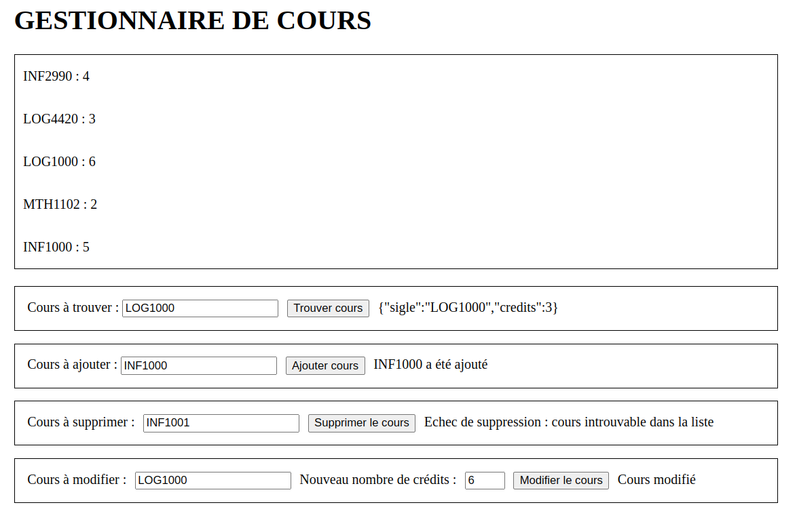

# Gestionnaire de cours et l'API Fetch

Cet exercice couvre les notions de communication HTTP et l'utilisation de l'API `Fetch` dans un navigateur.

Le site web disponible dans le répertoire [client](./client/) est une page web qui permet d'afficher et gérer une liste de cours. Cette liste et les manipulations sur celle-ci sont gérées par un serveur `NodeJS` dans le répertoire [server](./server/). Le site web doit donc communiquer avec le serveur par HTTP pour compléter les actions de l'utilisateur.

**Note** : le serveur n'a pas de persistance des données. Celles-ci sont supprimées si le serveur est fermé et la liste de cours par défaut est utilisée après chaque lancement du serveur.

**Note** : vous devez démarrer le serveur dynamique avant d'y accéder avec votre page web.

Le code source du serveur vous est fourni dans le fichier [main.js](./server/main.js) et vous n'avez qu'à lancer le serveur avec la commande `npm start` dans le répertoire `server`. 

N'oubliez pas d'installer les dépendances nécessaires avec `npm ci` dans le répertoire avant de lancer le serveur.

## Fonctionnalités à implémenter

Les fonctionnalités à implémenter sont tous dans le fichier [`fetch.js`](./client/fetch.js).

Par défaut, la page web ne fait que récupérer la liste des cours disponibles et les affiche dans une liste. Chaque cours a un sigle et un nombre de crédits. Par exemple :`{ sigle: "LOG1000", credits : 3 }`.

Vous devez rajoutez et implémenter les fonctionnalités suivantes :

### Recherche d'un cours

Vous devez compléter la fonction `findCourse()` qui récupère les informations d'un cours à partir de son sigle saisi dans la page. Si le champs de saisie est vide, le site ne devrait pas envoyer une requête au serveur.

Le chemin pour obtenir un cours est `/obtenirCours/{sigle}`. Par exemple, pour trouver l'information pour le cours `LOG1000`, l'URI serait `/obtenirCours/LOG1000`. Consultez le code dans le fichier [main.js](./server/main.js) pour comprendre le format de la réponse HTTP (codes et corps).

### Ajouter un cours

Vous devez compléter la fonction `addCourse()` qui envoie une demande de création d'un nouveau cours en fonction de son sigle saisi dans la page. Si le champs de saisie est vide, le site ne devrait pas envoyer une requête au serveur.

Le serveur gère l'assignation du nombre de crédits au cours (de 1 à 6) et l'ajoute à la liste existante et retourne un message. Le système refuse la création d'un cours s'il existe déjà un cours avec le même sigle et retourne un objet d'erreur.

Peu importe le résultat de l'ajout, vous devez afficher la réponse du serveur dans l'élément `span-add-result`.

Le chemin pour ajouter un cours est `/ajouterCours` et le serveur s'attend a un objet qui a au moins l'attribut `sigle`. Consultez le code dans le fichier [main.js](./server/main.js) pour comprendre le format de la réponse HTTP (codes et corps). Notez que le format de l'information n'est pas la même en fonction du code de retour.

### Supprimer un cours

Vous devez compléter la fonction `deleteCourse()` qui envoie une demande de suppression d'un cours en fonction de son sigle saisi dans la page. Si le champs de saisie est vide, le site ne devrait pas envoyer une requête au serveur.

Le serveur gère la suppression du cours retourne un message. Le système peut détecter si le sigle à supprimer existe ou non dans la liste et modifie sa réponse en fonction.

Peu importe le résultat de la suppresion, vous devez afficher la réponse du serveur dans l'élément `span-delete-result`.

Le chemin pour supprimer un cours est `/supprimerCours/{sigle}`. Par exemple, pour supprimer le cours `LOG1000`, l'URI serait `/supprimerCours/LOG1000`. Consultez le code dans le fichier [main.js](./server/main.js) pour comprendre le format de la réponse HTTP (codes et corps).

### Modifier un cours

Vous devez compléter la fonction `changeCourse()` qui envoie une demande de modification du nombre de crédits d'un cours en fonction de son sigle et le nouveau nombre de crédits saisis dans la page. Si les champs de saisie sont vides, le site ne devrait pas envoyer une requête au serveur.

Le serveur gère la modification du cours retourne un message. Le système peut détecter si le sigle à modifier existe ou non dans la liste et modifie sa réponse en fonction.

Peu importe le résultat de la modification, vous devez afficher la réponse du serveur dans l'élément `span-modify-result`.

Le chemin pour modifier un cours est `/modifierCours` et le serveur s'attend a un objet qui a au moins les attribut `sigle` et `credits`. Consultez le code dans le fichier [main.js](./server/main.js) pour comprendre le format de la réponse HTTP (codes et corps).

## Affichage du site

Voici un exemple du site web après les modification suivantes (dans cet ordre) :
1. Recherche du cours `LOG1000`
2. Ajout du cours `INF1000`
3. Tentative de suppression du cours `INF1001` qui n'existe pas
4. Modification des crédits du cours `LOG1000` à 6

# Solution

Une solution est disponible dans le fichier [solution.js](./client/solution.js). Cette solution utilise uniquement la syntaxe de `Promise`, mais il est aussi possible de compléter l'exercice en utilisant `async`/`await` également.

# Question théorique

Est-ce que le système considère les cours `LOG1000` et `log1000` les mêmes dans sa version présente ? Que faudrait-il faire pour s'assurer que ça soit le cas ?

Une réponse est disponible à la fin du fichier [solution.js](./client/solution.js).