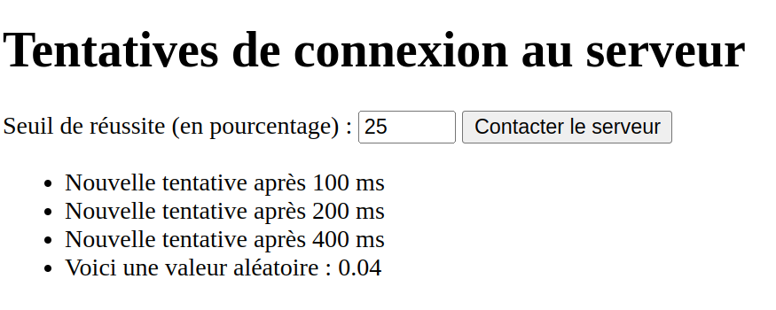

# Exponential backoff et les promesses

_Exponential Backoff_ est un algoritme de gestion des requêtes où une requête échouée est repétée après un délai variable pour essayer d'avoir une réponse réussie. Comme son nom l'indique, le délai est incrémenté de manière exponentielle, souvent par des puissances de 2 :  `2^nbTentatives`.

Cette manière de faire est utilisée dans la réseautique et le web dans le cas d'une communication avec un service externe qui peut ne pas répondre du à une charge de travail trop grande, un échec d'opération ou toute autre situation potentielle.

L'exemple présenté dans [index.html](./index.html) et [retry.js](./retry.js) est une simulation d'un appel à un serveur qui a un certain pourcentage de chance (configurable) de répondre à la requête.

## Exemple

Voici un exemple de requête réussie après 3 tentatives :

## Code à implémenter

Vous devez implémenter la fonction `retryWithBackoff(promiseFn, maxRetries)` qui tente d'appeler la fonction en paramètre `promiseFn` jusqu'à `maxRetries` fois. La fonction retourne un objet `Promise`.

La fonction `promiseFn` retourne un objet `Promise<string>`. Dans notre cas, cette fonction sera la fonction `fetchData` qui génère un chiffre aléatoire et le compare au seuil de réussite défini dans la page web. La promesse est alors résolue ou rejetée avec un message.

Si la promesse retournée par `promiseFn` est résolue, sa valeur est retournée directement et sera affichée à l'écran.

Si la promesse est rejetée, il faut vérifier si on peut faire une autre tentative d'appel. 

Si nous avons atteint `maxTries`, il faut rejeter la promesse de `retryWithBackoff`. 

Sinon, il faut calculer un nouveau délai de `100*(2^nombreTentatives)`ms, l'afficher dans le message `Nouvelle tentative après ${delai} ms` et relancer `promiseFn` après ce délai. Avec le code fourni, la fonction va faire un maximum de 4 tentatives, donc au plus 800ms de délai pour la dernière requête.

## Contraintes d'implémentation

Voici 2 contraintes à respecter pour l'implémentation de votre exercice :

- Vous devez utiliser seulement la syntaxe `Promise` et non `async`/`await` pour cet exercice.
- Vous ne pouvez pas utiliser des boucles ou des méthodes d'itération dans votre implémentation

## Seuil de réussite

Il est possible de définir le seuil de réussie de `fetchData` dans la page web. Ce seuil est par défaut à 25%, mais vous pouvez le changer de 1 à 100%.

Une valeur de 1% vous donnera des fortes chances d'atteindre la limite de nombre de requêtes. Notez cependant que `Math.random()` n'est pas une fonction parfaitement uniforme et vous pouvez avoir un succès dès la première requête, même avec 1% de seuil.