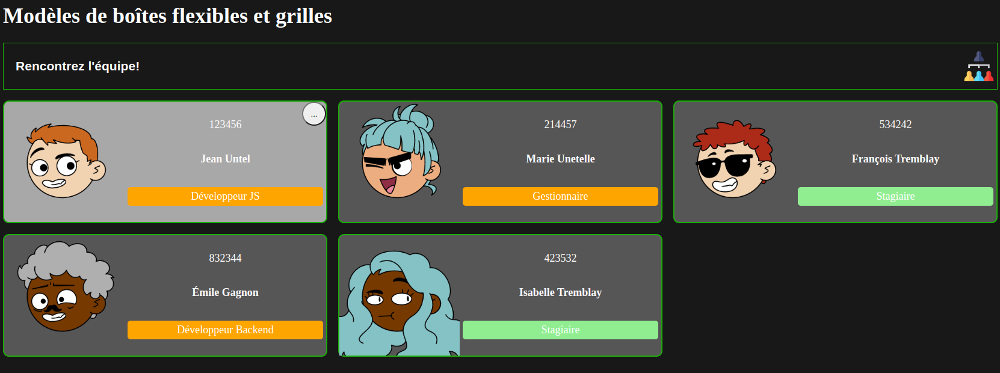

# Exercice sur les boîtes flexibles et les grilles

L'exercice couvre les notions de positionnement des éléments HTML à travers des boîtes flexibles (_`flexbox`_) et des grilles (_`grid`_). Vous aurez à utiliser les 2 techniques ensemble pour compléter l'exercice. Une solution utilisant uniquement _`grid`_ est également disponible.

Vous aurez également à utiliser la notion de variables `CSS`. 

# Exercice #1 : Mise en page

Le code fourni dans le fichier [index.html](./index.html) présente une simple page de gestion du personnel de votre équipe. Chaque personne est représentée par une vignette qui contient son avatar, son numéro d'employé, son nom et son poste dans l'équipe.

Vous devez implémenter les règles CSS nécessaires pour reproduire le rendu visuel final présenté plus bas dans le fichier [styles.css](./styles.css). Vous ne pouvez pas modifier le code HTML fourni : éléments, attributs, arborescence,etc. Quelques règles de base vous sont déjà fournis : vous aurez à les modifier pour compléter l'exercice. Vous pouvez modifier les valeurs par défaut fournies pour les variables de couleur pour un rendu visuel différent.

Voici les éléments à compléter :
- L'arrière-plan de toute la page doit avoir une couleur uniforme.
- Les éléments de texte doivent avoir une couleur uniforme qui est en contraste avec l'arrière-plan. 
- L'entête et les vignettes doivent avoir un contour de la même couleur.
- Le texte et le logo dans l'entête doivent être alignés à gauche et à droite respectivement sur la même ligne. Les deux doivent être alignés au centre verticalement.
- Il doit avoir un espace uniforme entre l'entête et le conteneur des vignettes ainsi qu'entre les vignettes.
- Les vignettes sont présentés en 3 colonnes qui occupent tout l'espace disponible. 
- Les colonnes ont une taille minimale de 450px et doivent avoir la même taille en tout temps. _Astuce_ : la fonction [`minmax(a,b)`](https://developer.mozilla.org/en-US/docs/Web/CSS/minmax) permet de spécifier une taille entre `a` et `b`.
- Chaque vignette doit avoir les éléments suivants :
    - La couleur de fond doit être uniforme.
    - La couleur de fond doit être différente lorsque survolée.
    - Le bouton `...` doit être dans le coin supérieur droit.
    - L'avatar doit être aligné à gauche.
    - Les informations doient être alignées à droite et centrés entre-eux.
    - Le poste doit avoir un arrière-plan qui prend tout l'espace disponible.
    - L'arrière-plan du poste doit avoir une couleur différente si la personne est stagiaire.

## Rendu visuel final

Dans cet exemple, la première vignette est survolée par la souris.

# Exercice #2 : Présentation des vignettes flexible

L'exercice #1 vous demande d'avoir une grille qui contient toujours 3 colonnes. Ceci implique la présence d'une barre de défilement horizontale lorsque la taille de la fenêtre est plus petite que la taille de 3 vignettes.

Vous devez modifier le code pour que le nombre de colonne s'ajuste en fonction de l'espace disponible.\
Ex : s'il n'y a pas de place pour 3 vignettes, la page présente 2 vignettes qui occupent tout l'espace disponible. Également, s'il y a de l'espace pour 4 vignettes avec la taille minimale demandée, la page présente 4 colonnes à la fois.

_Astuce_ : le 1er paramètre de la fonction [`repeat`](https://developer.mozilla.org/en-US/docs/Web/CSS/repeat) peut prendre une valeur spécifique qui permet de calculer le nombre de colonnes nécessaires automatiquement.

# Solutions

Les solutions des exercices sont disponibles dans le fichier [solution.css](./solution.css).

Vous pouvez référencer le fichier en modifiant l'attribut `href` de la ligne <code>8</code> du fichier [`index.html`](./index.html).

Le fichier contient les règles de mise en page possibles pour l'exercice #1. Notez qu'il peut avoir plus qu'une bonne réponse possible qui mène au même résultat.

Une solution possible qui utilise uniquement des `grid` est disponible dans le fichier [solution_grid.css](./solution_grid.css). Notez que, généralement, l'utilisation de `flexbox` est à préférer pour une mise en page en 1 dimension des éléments HTML.

### Sources des images utilisées

[Icone](https://www.flaticon.com/free-icons/new-hire)

[Logo](https://www.flaticon.com/free-icons/members)

[Avatars](https://www.dicebear.com/playground)
