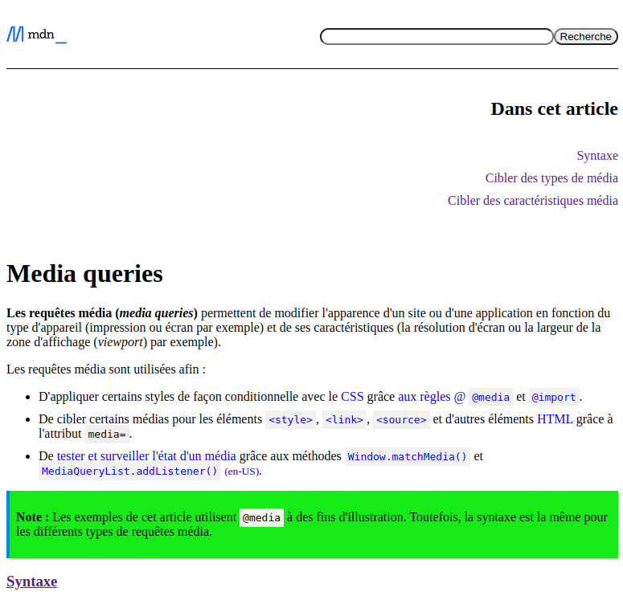
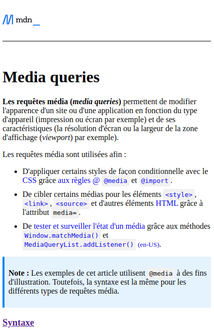

# Exercice sur les requêtes média

L'exercice suivant est séparé en 2 sections et couvre les notions de requêtes média du langage `CSS`

# Exercice #1 : Mise en page pour des écrans différents

Le code fourni dans le fichier [index.html](./index.html) présente une vue similaire d'une page de la [documentation MDN](https://developer.mozilla.org/fr/) sur les requêtes média. La page contient un entête, du contenu textuel principal et une table des matières du contenu de la page.

Vous devez implémenter les règles CSS nécessaires pour reproduire les rendus visuels finaux présentés plus bas dans le fichier [styles.css](./styles.css). Vous ne pouvez pas modifier le code HTML fourni : éléments, attributs, arborescence,etc.

Vous devez implémenter les changement suivants à travers des requêtes média.
- Lorsque la largeur de la page est plus petite que `800px` :
    - La table des matières doit être placée entre l'entête et le contenu principal sans sa bordure gauche
    - La table des matières doit être alignée à droite et ne plus suivre le déroulement de la page
    - Les bordures vides à gauche et à droite de la page doivent être retirées
- Lorsque la largeur de la page est plus petite que `450px` :
    - L'entête et la table des matières ne devraient pas être visibles sur la page
    - La table dans la section `Caractéristiques média` doit prendre tout l'espace horizontal disponible
- Lorsque la largeur de la page est entre `450px` et `800px` :
    - La couleur de l'arrière-plan des sections de **Note** doit être `#15ec15`. Pour l'exercice, ce changement doit être implémenté à l'aide d'une seule requête média. 

Vous pouvez simuler le changement de la taille de l'écran en ouvrant les outils de développement (raccourci <kbd>F12</kbd> sur Chrome, Firefox, Edge) et activer l'émulateur d'appareils (raccourci <kbd>CTRL+SHIFT+M</kbd> dans les mêmes navigateurs).

Chrome vient avec certains appareils préconfigurés comme l'iPhone SE (`375px` * `667px` en mode portrait) qui permet de tester vos requêtes média en fonction de son orientation.

## Rendu visuel final

### Rendu visuel sous 800px

### Rendu visuel sous 450px

# Exercice #2 : Mise en page pour impression

Il est possible de modifier la mise en page d'une page web lorsqu'on veut l'imprimer. Par exemple, les navigateurs vont, par défaut, retirer les couleurs d'arrière-plan des éléments HTML.

## Partie 1

La requête média qui vous est fournie vise à retirer la bordure gauche des éléments de **Note** ainsi que les bordures de la table à la fin du document. Cependant, ces éléments sont toujours visibles lorsqu'on veut imprimer la page (raccourci <kbd>CTRL+P</kbd> sur Chrome, Firefox, Edge). Quelle est la raison de ce comportement et comment peut-on régler ce problème ?

## Partie 2

Vous devez implémenter les changements suivants pour la mise en page du document pour une impression :
- L'entête et la table des matières ne doivent pas être visibles
- Le contenu principal doit occuper tout l'espace disponible (les marges d'impression par défaut peuvent rester)
- Il doit avoir un saut de page avant les sections `Types de média` et `Caractéristiques média`. _Note_: il y a plus qu'une propriété CSS possible qui permet ce comportement 

# Solutions

Les solutions des 2 exercices sont disponibles dans le fichier [solution.css](./solution.css).

Vous pouvez référencer le fichier en modifiant l'attribut `href` de la ligne <code>7</code> du fichier [`index.html`](./index.html).

Le fichier contient les règles de mise en page possibles pour l'exercice #1. Notez qu'il peut avoir plus qu'une bonne réponse possible qui mène au même résultat.

Les réponses de l'exercice #2 sont également données dans le code CSS. La réponse à la 1re partie de la question est dans un commentaire.