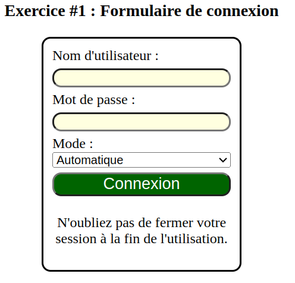

# Exercice

L'exercice suivant est séparé en 3 sections et couvre les notions de base du langage `CSS` : 
- Les sélecteurs CSS : simples, hiérarchiques, de voisins, attributs, pseudo classes et pseudo attributs.
- Les propriétés CSS et leurs impacts sur le visuel des éléments HTML.

# Exercice #1 : Mise en page

Le code fourni dans le fichier [index.html](./index.html) présente un simple formulaire de connexion. Vous devez implémenter les règles CSS nécessaires pour reproduire le rendu visuel final présenté plus bas dans le fichier [styles.css](./styles.css). Vous ne pouvez pas modifier le code HTML fourni : éléments, attributs, arborescence,etc. Quelques règles de base vous sont déjà fournis : vous pouvez les modifier pour compléter l'exercice. 

Voici les éléments à compléter pour le formulaire :
- Le formulaire devrait avoir une bordure noire d'une taile de `2px`.
- Plusieurs éléments doivent avoir une bordure arrondie (valeur d'arrondissement laissé à votre choix)
- Les champs de saisie, le menu déroulant et le bouton `Connexion` devraient prendre 100% de la taille disponible.
- Les champs de saisie devraient avoir une couleur de fond dont le code RGB est `ffffe0`.
**Note** : Vous devez implémenter cette règle avec un seul sélecteur.
- Les champs de saisie devraient avoir des marges de haut/bas de `5px` et aucune marge à gauche/droite.
- Le bouton `Connexion` devrait avoir un texte plus large que le reste du formulaire avec une couleure blanche sur un fond vert (valeurs RGB exactes laissées à votre choix).
- Lorsque le bouton est survolé, son texte devrait devenir encore plus grand et la couleur de fond devrait être plus pâle.
- Le texte de rappel à la fin du formulaire devrait être centré.

## Rendu visuel final

# Exercice #2 : Sélecteurs CSS

Il est possible d'avoir plusieurs sélecteurs différents qui ciblent le même élément dans un document HTML. Vous devez doner 4 sélecteurs différents pour l'élément `<input>` de la ligne `35` du fichier [`index.html`](./index.html#l35).

Voici les contraintes suivantes à respecter pour les sélecteurs à trouver :
- En utilisant un sélecteur par attribut 
- En utilisant des sélecteurs hiérarchiques 
- En utilisant un sélecteur de voisins
- En utilisant la pseudo classe `:not()`

Notez qu'il y a plusieurs solutions possibles pour certaines contraintes.

# Exercice #3 : Modification d'un marqueur

Le langage CSS permet de modifier des éléments dans la page qui ne sont pas de vrais éléments HTML. Un tel exemple est le symbole (marqueur) au début de chaque entrée d'une liste qui est un `pseudo élément` HTML. 

Vous devez ajouter une règle CSS qui modifie le marqueur d'une entrée de la liste pour le symbole ★ d'une couleur différente lorsqu'on survole l'entrée avec votre souris et augmente sa taille. Lorsque la souris quitte l'éntrée, le marqueur revient à sa taille, sa couleur et son symbole par défaut.

_Astuce_ : l'action de _survoler_ un élément modifie `l'état` de l'élément, ce qui peut être détecté par la présence d'une `pseudo classe` HTML.

# Solutions

Les solutions des 3 exercices sont disponibles dans le fichier [solution.css](./solution.css).

Vous pouvez référencer le fichier en modifiant l'attribut `href` de la ligne <code>7</code> du fichier [`index.html`](./index.html).

Le fichier contient les règles de mise en page possibles pour l'exercice #1. Notez qu'il peut avoir plus qu'une bonne réponse possible qui mène au même résultat.

Les réponses de l'exercice #2 sont également données dans le code CSS. La réponse fait usage du pseudo élément `::after` et la propriété `content` pour afficher le contenu de la réponse. 

Pour voir l'effet visuel de l'exercice #3, vous devez survoller un des éléments de la liste de l'exercice #2 avec votre souris. Notez que vu la valeur exacte des propriétés à utiliser est laissée à votre choix, la réponse peut varier du code que vous avez écrit.