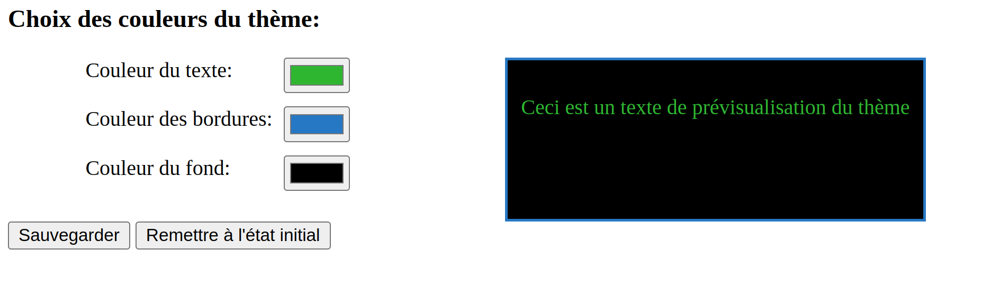

# WebStorage API et la persistance des données

Ces exercices couvrent les notions d'utilisation du [WebStorage API](https://developer.mozilla.org/en-US/docs/Web/API/Web_Storage_API) pour persister des données dans le navigateur.

Les exercices utilisent également des notions de manipulations du DOM ainsi que la gestion de certains événements dans la page. 

Le premier exercice se base sur l'exercice HTML [suivant](https://github.com/LOG2440/Exercices/tree/master/HTML/Form) avec quelques modifications légères au niveau de la structure HTML/CSS de la page.

Les deux exercices sont indépendants un de l'autre : vous pouvez implémenter l'exercice 2 avant l'exercice 1 si vous le désirez.

## Exercice 1 : Sauvegarde de l'état d'un formulaire

Vous devez implémenter une sauvegarde temporaire des données entrées dans le formulaire de la page [index.html](./index.html). Le code à modifier se trouve dans [form_saver.js](./js/form/form_saver.js).

La sauvegarde permet de persister l'état d'avancement du formulaire à travers un rechargement de la page afin d'améliorer l'expérience utilisateur. Par défaut, un rafraîchissement de la page (ex: touche <kbd>F5</kbd>) réinitialise le formulaire à son état initial et tous les champs remplis perdent leur information.

### Implémentation demandée 

L'utilisateur doit pouvoir rafraîchir la page et voir les champs ayant déjà une valeur garder celle-ci au moment du rafraîchissement. Le formulaire possède 4 champs : un choix "oui"/"non", une note de 1 à 5 ainsi que 2 champs de saisie pour un commentaire (titre et message).

La sauvegarde devrait persister seulement si la page est encore ouverte. Si la page est fermée et accédée de nouveau d'une manière autre que sa restauration par le navigateur, le formulaire devrait être affiché dans son état initial.

Une fois le formulaire soumis, la sauvegarde est supprimée et le formulaire est affiché dans son état initial. 

**Rappel** : il y a plusieurs manières de détecter le changement des éléments HTML à travers les événements du DOM. Vous avez une flexibilité au niveau de votre implémentation, mais visez une utilisation minimale des événements pour compléter cet exercice. 

### Solution

Une solution est disponible dans le fichier [form_solution.js](./js/form/form_solution.js). Vous pouvez référencer le fichier en modifiant l'attribut src de la ligne 9 du fichier [index.html](./index.html).

Notez qu'il y a plusieurs manières de compléter cet exercice et votre solution peut être différente, mais aussi fonctionnelle que le corrigé proposé.

## Exercice 2 : partage d'un thème visuel

Vous devez implémenter une sauvegarde d'un thème visuel configurable à travers toutes les pages du site (`index.html` et `theme.html`).

Par défaut, le fichier [shared.css](./css/shared.css) contient 3 variables CSS globales qui définissent les couleurs du texte, de la bordure et de l'arrière-plan du formulaire de la page `index.html`.

La page [theme.html](./theme.html) présente un éditeur intéractif des 3 couleurs du site. Un changement à travers des champs de saisie de couleur à gauche est reflété dans le rectangle de prévisualisation à droite.

### Éditeur de couleurs

Voici un exemple de l'édition d'un thème "sombre" pour le site web.

### Implémentation demandée 

Vous devez implémenter la gestion de la sauvegarde du thème visuel modifiable par l'éditeur. La sauvegarde doit persister à travers une fermeture complète du site et le thème doit s'appliquer sur toutes les pages du site.

Le bouton `Sauvegarder` permet de sauvegarder les couleurs en cours de l'éditeur en tant que thème du site.

Le bouton `Remettre à l'état initial` permet de supprimer le thème modifié et revenir aux couleurs initiales du site. Le bouton recharge également la page pour illustrer le changement appliqué.

Le code à modifier se trouve dans [theme.js](./js/theme/theme.js). Vous devez également implémenter le chargement du thème dans la page principale au début du fichier [form_saver.js](./js/form/form_saver.js).

### Solution

Une solution est disponible dans les fichiers[theme_solution.js](./js/theme/theme_solution.js) et [form_solution.js](./js/form/form_solution.js). Vous pouvez référencer le fichier en modifiant l'attribut src de la ligne 9 des fichiers [index.html](./index.html) et [theme.html](./theme.html).