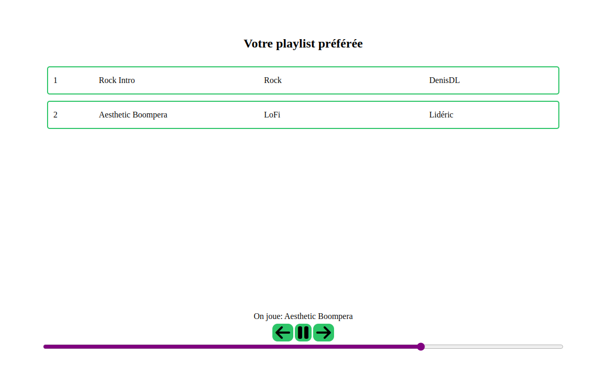

# Gestion des événements

Ces exercices couvrent les notions de gestion des événements dans une page web ainsi que la gestion des propriétés `dataset` des éléments du DOM.

Vous aurez à gérer des événements de la souris, du clavier ainsi que des événements sur des éléments du DOM autres tel que [`audio`](https://developer.mozilla.org/en-US/docs/Web/API/HTMLAudioElement).

# Lecteur de musique

Vous aurez à implémenter le fonctionnement d'un lecteur de musique, à la `Spotify`. Une grande partie de la logique vous est déjà fournie et vous devez la compléter et lier la logique à différents événements pour rendre la page intéractive.

La page [index.html](index.html) présente une liste de chansons avec un ensemble de contrôles pour la musique : 
- un bouton pour jouer/mettre en pause
- un bouton pour jouer la chanson précédante
- un bouton pour jouer la prochaine chanson
- une barre de progrès qui permet de se déplacer dans la chanson 

La page indique également le nom de la chanson en cours juste en haut des contrôles.

## Visuel de la page

Voici un exemple du résultat final attendu avec une chanson en cours :

## Exercice 1 : Charger et jouer une chanson

Chaque élément HTML ayant la classe `song-item` contient 2 propriétés `data` qui indiquent le nom de la chanson ainsi que le lien vers le fichier audio à jouer. 

Vous devez assigner l'attribut `src` de la variable `audio` au lien de la 1re chanson au chargement de la page. 

Vous devez compléter la fonction `play()` fournie et afficher le nom de la chanson jouée dans le bon élément HTML. Vous dous devez lier les fonctions `playPrevious()`, `play()` et `playNext()` aux bons contrôles dans l'interface dans la fonction `bindEvents()`. 

Consultez les descriptions des fonctions pour mieux comprendre leur fonctionnement. Notez que le code fourni gère une "boucle infinie" : dans le cas de la dernière chanson, la prochaine est la 1re de la liste et vice versa.

Vous devez ajouter un gestionnaire sur chaque élément `song-item` qui permet de jouer la chanson décrite par l'élément suite à un clic sur celui-ci. Un utilisateur peut cliquer n'importe où sur l'élément pour faire jouer la chanson.

## Exercice 2 : Gérer le progrès d'une chanson

Le gestionnaire fourni de l'événement `input` sur la barre de progrès, permet de faire jouer un moment précis de la chanson de 0 à 100% de sa durée. Il n'y a cependant pas de rétroaction visuelle lors du progrès de la chanson et le son se termine à la fin de la chanson.

Vous devez implémenter un passage automatique à la prochaine chanson lorsque la chanson en cours se termine. 

Vous devez également implémenter une mise à jour de la barre de progrès en fonction de l'avancement de la chanson. Notez que l'élément `<input>` a une valeur minimale de `0` et maximale de `100` : vous devez donc normaliser l'état d'avancement de l'audio sur `100`, peu importe sa durée totale.

Consultez la documentation de l'inteface [`HTMLMediaElement`](https://developer.mozilla.org/en-US/docs/Web/API/HTMLMediaElement) qui est implémentée par l'objet `Audio` que vous utilisez. Vous aurez besoin de certaines propriétés et événements de l'objet `audio` pour compléter cet exercice.

Vous devez implémenter ces comportements dans la fonction `bindEvents()`.

## Exerice 3 : Utiliser des raccourcis de clavier

Vous devez implémenter une manière alternative de contrôler la musique à travers des raccourcis du clavier. Ces raccourcis devraient être disponibles globalement sur la page et toute autre touche ne devrait pas avoir un effet sur la page.

Vous devez implémenter la gestion des raccourcis dans la fonction `bindShortcuts()`. L'objet `shortcutManager` vous est fourni pour vous aider. Cet objet est de type [`Map<string, function>`](https://developer.mozilla.org/en-US/docs/Web/JavaScript/Reference/Global_Objects/Map) et permet de lier un raccourci à une fonction.

Vous devez implémenter les raccourcis suivants :
 - Espace (' ') : jouer/mettre pause la chanson
 - N            : prochaine chanson
 - P            : chanson précédante
 - J            : reculer de 5 secondes dans la chanson
 - L            : avancer de 5 secondes dans la chanson

## Solution :

Une solution est disponible dans le fichier [solution.js](./solution.js). Vous pouvez référencer le fichier en modifiant l'attribut src de la ligne 9 du fichier [index.html](./index.html).

Notez qu'il y a plusieurs manières de compléter cet exercice et votre solution peut être différente, mais aussi fonctionnelle que le corrigé proposé.

## Sources externes et extensibilité

Les fichiers audio utilisés pour les exercices proviennent du site [pixabay](https://pixabay.com/music/).

La librairie [FontAwesome](https://fontawesome.com/) a été utilisée pour les icônes des boutons de contrôle.

Pour des fins de simplicité, l'exemple utilise seulement 2 chansons avec des valeurs directement écrites dans le code HTML. 

Vous pouvez ajouter autant de chansons que vous voulez et rendre la liste de chansons plus complète si vous voulez. Vous n'avez qu'à garder la même structure HTML et fournir les bonnes propriétés `data` aux nouveaux éléments HTML.