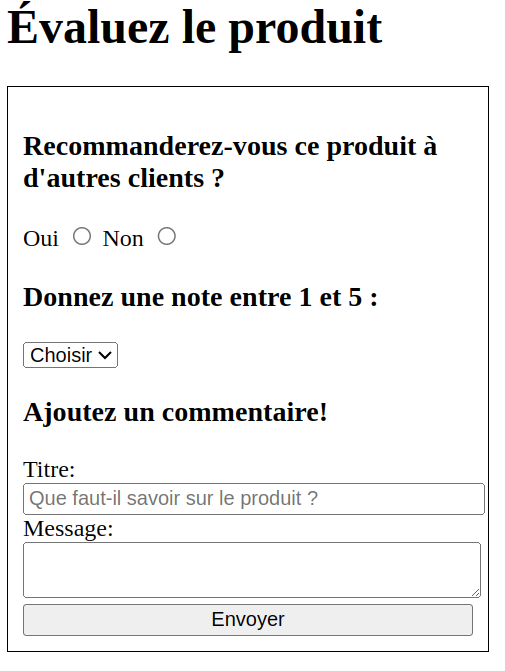

# Exercice

Implémentez un formulaire d'évaluation d'un produit sur un site de commerce en ligne (ex : Amazon) dans le fichier [index.html](./index.html).

Le formulaire comporte les 3 sections suivantes qui sont déjà fournis.\
Référez-vous à la capture d'écran plus bas pour le visuel final attendu.

## Recommandation

L'utilisateur peut choisir entre `Oui` et `Non`. Les 2 options sont mutuellement exclusives.\
Astuce : l'élément [`<input>`](https://developer.mozilla.org/en-US/docs/Web/HTML/Element/input) est très versatile à travers son attribut [type](https://developer.mozilla.org/en-US/docs/Web/HTML/Element/input#input_types).

## Note

L'utilisateur doit choisir, à travers un menu déroulant, une note entre 1 et 5. Une option `Choisir` est disponible par défaut, mais n'est pas une option qu'on peut choisir. \
Astuce : l'élément [`<option>`](https://developer.mozilla.org/en-US/docs/Web/HTML/Element/option) et ses [attributs](https://developer.mozilla.org/en-US/docs/Web/HTML/Element/option#attributes) vous seront utiles.

## Commentaire

L'utilisateur doit laisser un commentaire avec un titre. Le titre contient un texte de remplacement (_placeholder_) tel que présenté dans la capture d'écran. Le message doit contenir au moins 10 caractères pour que le formulaire soit considéré comme valide. L'utilisateur doit pouvoir modifier la taille du champ de saisi pour le message. \
Astuce : il y a plusieurs manières d'implémenter un champ de saisi en HTML. Les règles CSS fournies contiennent un indice. 

## Validation et Envoi

L'utilisateur doit pouvoir soumettre le tout à travers un bouton `Envoyer`. Tous les champs sauf le choix de recommandation sont obligatoires pour valider le formulaire. Pour cet exercice, implémentez le mécanisme d'envoi sans utiliser la balise `<button>`.

# Rendu visuel final

# Solution

Une solution possible est disponible dans le fichier [solution.html](./solution.html).

Il peut y avoir plusieurs solutions possibles. Les éléments `
` auraient pu être remplacés par `<section>` qui sont sémantiquement équivalents.