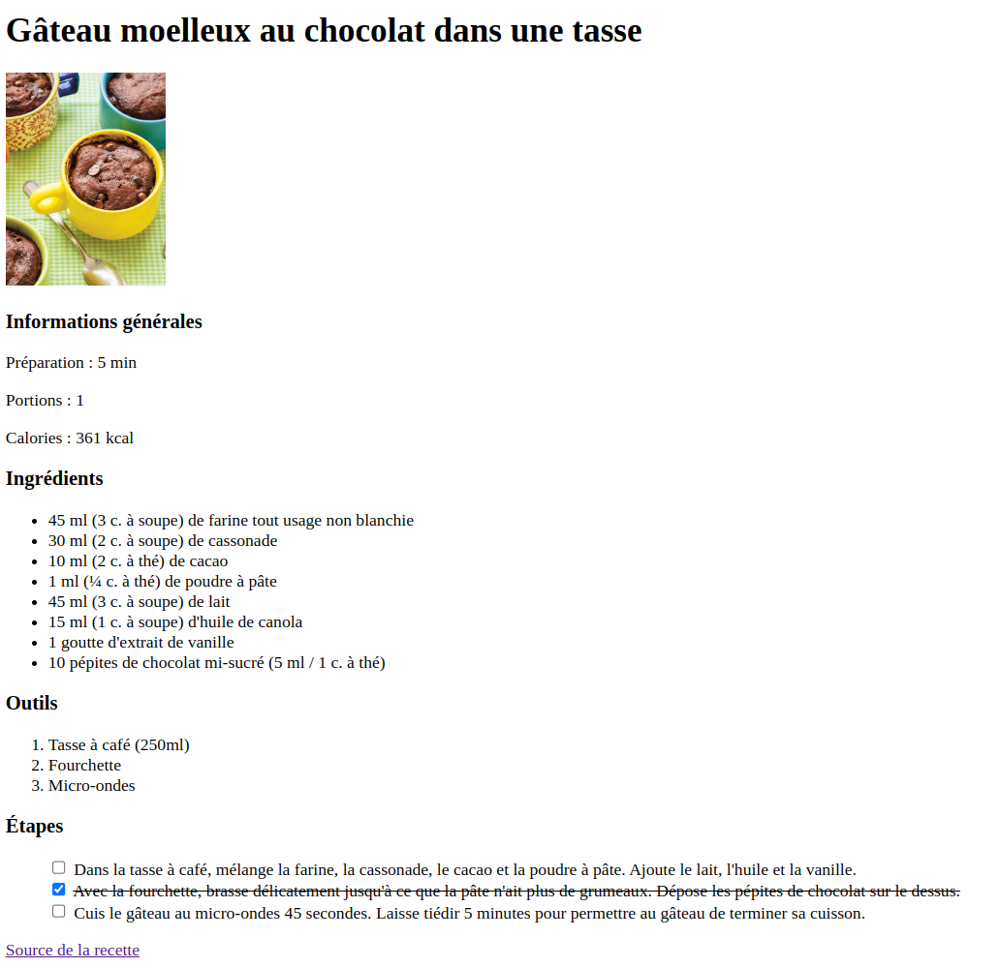

# Exercice

Implémentez une page de recette dans le fichier [index.html](./index.html) à partir de la description textuelle initiale.

Utilisez différentes balises HTML pour décrire le contenu de la page. Rappel : le langage HTML permet de décrire le contenu d'une page web et le langage CSS s'occupe de la mise en page.

Vous devez faire les modifications suivantes :
- Le titre de l'onglet dans le navigateur doit être le même que le nom de la recette
- Le nom de la recette doit être en **gras** et d'une taille plus grande que le reste du document.
- Les éléments des segments `Informations générales`, `Ingrédients`, `Outils` et `Étapes` devraient être regroupés dans le HTML
    - Chaque regroupement doit avoir un titre en **gras** et d'une taille plus grande
- Dans `Informations générales`, chaque valeur numérique doit être dans une balise dédiée avec un attribut `id` unique
- Les ingrédients de la recette devraient être représentés avec une liste de points et chaque ingrédient doit être sur une ligne séparée.
- Les outils devraient être représentés avec une liste numérotée et chaque outil doit être sur une ligne séparée. 
- Les étapes de la recette deraient être représentés avec une liste de cases à cocher et chaque étape doit être sur une ligne séparée.
    - L'utilisateur doit être capable de cocher la case en cliquant sur le texte de l'étape. Astuce : considérez le rôle de l'élément `<label>` fourni.

Référez-vous à la capture d'écran plus bas pour le visuel final attendu.\
La règle CSS à la ligne 43 permet de cacher le point des éléments de la liste.\
La règle donnée dans `<style>` permet de ~~barrer~~ le texte d'une étape si la case correspondante est cochée.

# Rendu visuel final

# Solution

Une solution possible est disponible dans le fichier [solution.html](./solution.html).

Il peut y avoir plusieurs solutions possibles et valides. Notez que les identifiants que vous avez utilisés peuvnet être différents que ceux dans la solution.