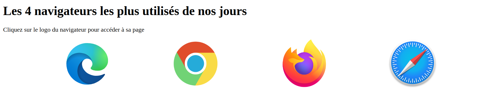

# Exercice

Cet exercice combine les notions suivantes :
- Éléments sémantiques du HTML
- Hyperliens entre différents documents
- Attributs universels et spécifiques d'éléments HTML.

L'exercice est divisé en 2 parties : 

## 1. Menu de navigation

Implémentez un menu de navigation qui utilise les images des logos des différents navigateurs pour rediriger l'utilisateur vers les différentes pages spécifiques de chaque navigateur dans [index.html](./index.html). Rappel : le lien entre différentes pages HTML se fait à travers la balise `<a>` (_anchor_) et un de ses attributs spécifiques.

Chaque lien de navigation devrait avoir une info-bulle (_tooltip_) avec le nom du navigateur lorsqu'un utilisateur place sa souris par-dessus. Il existe un [attribut universel](https://developer.mozilla.org/en-US/docs/Web/HTML/Global_attributes) qui permet une telle fonctionnalitée. 

Astuces : 
- l'élément [`<nav>`](https://developer.mozilla.org/en-US/docs/Web/HTML/Element/nav) représente sémantiquement la notion de menu de navigation dans une page web.
- l'élément [``](https://developer.mozilla.org/en-US/docs/Web/HTML/Element/img) ne peut pas avoir d'autres éléments comme enfants, mais il peut être un enfant pour d'autres éléments HTML.

## 2. Mise en page

Par défaut, les images fournis sont toutes de tailles différentes, ce qui nuit à l'expérience utilisateur. Il est possible d'uniformiser l'affichage de ces éléments à travers du code `CSS`. Nous voudrions avoir des images de la même taille qui occupent tout l'espace horizontal avec un espacement uniforme entre chaque logo.

Le fichier [styles.css](./styles.css) contient quelques règles CSS pour une mise en page uniforme, mais n'est pas lié au document HTML. Vous devez faire le lien entre les 2 documents.

Pour que toutes les images aient la même taille, vous devez leur appliquer la même règle. Rappel : il existe un attribut universel qui permet de traiter plusieurs éléments HTML en même temps dans le code CSS.

Pour que les images occupent tout l'espace horizontal avec un espacement uniforme, vous devez appliquer un ensemble de règles spéciales à l'élément qui les contient. Rappel : il existe un attribut universel qui permet de traiter un élément HTML ciblé dans le code CSS.

Référez-vous à la capture d'écran plus bas pour le visuel final attendu.\
Référez-vous au fichier [styles.css](./styles.css) pour les valeurs des attributs à donner pour appliquer les règles CSS nécessaires.

# Rendu visuel final

# Solution

Une solution est disponible dans le fichier [solution.html](./solution.html). 

# Exercice supplémentaire

Cet exercice couvre seulement 4 navigateurs. Ajoutez une nouvelle page pour un autre navigateur de votre choix (`Opera`, `Brave`, etc.) et ajoutez le lien dans le menu de navigation.\
Vous pouvez utiliser les pages existantes comme gabarit ou modifier le contenu pour une présentation différente. 