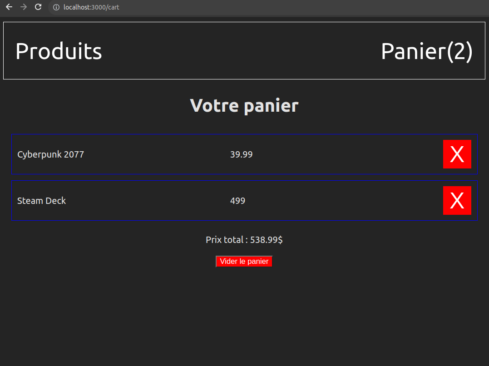

# Application Monopage et gestion d'état partage

React permet le développement d'application monopages (_single page application_) qui sont caractérisées par le fait qu'on a une seule page HTML et le contenu est chargé dynamiquement en fonction des besoins de l'application. Même si on défini plusieurs routes, le document HTML reste le même et une partie du DOM est modifiée pour simuler le changement des pages.

Ceci permet de plus facilement garder un visuel commun entre les "pages" du site web sans dupliquer le HTML. De plus, comme le contexte JS est le même, il est possible de partager un état entre plusieurs pages sans passer par un intermédiaire comme le _Storage API_ ou un serveur externe.

React permet de gérer un état partagé par plusieurs composantes différents à travers le concept de `Context`. Rappel : une composante a accès à un contexte ssi son fournisseur (`Provider`) est son ancêtre dans l'arborescence des composantes. 

React utilise également le paton SAM (_State Action Model_) utilisant la notion de `reducer` pour la gestion d'un état à travers plusieurs composantes.

## Installation des dépendances et lancement du projet

Vous pouvez installer les dépendances du projet avec la commande `npm ci`.

Vous pouvez lancer la transpilation et le lancement d'un serveur statique avec la commande `npm start`. Votre page web sera disponibles sur `localhost:3000`.

## Exercice 

Dans cet exercice, vous devez implémenter un site d'achat qui possède 2 "pages" :
- La page principale, disponible à travers le chemin `/`, qui affiche une liste de produits (disponibles dans [product.js](./src/products.js)). Chaque produit peut être ajouté à notre panier à travers un bouton.
- La page du panier, disponible à travers le chemin `/cart` qui affiche le contenu du panier et la somme totale de celui-ci. Chaque produit dans le panier peut être retiré à travers un bouton et il est possible de vider le panier au complet à travers un bouton dédié.

Les 2 pages se partagent la même entête qui contient un lien vers chaque page.

Le code de départ est disponible dans le répertoire [components](./src/components) et, par défaut, la composante [App.jsx](./src/components/App.jsx) contient ces 3 éléments dans la même page.

## Partie 1 : gestion des routes et chargement des produits

Vous devez modifier le code des composantes [App](./src/components/App) et [Header](./src/components/Header.jsx) pour séparer la vue des produits ([ProductPage](./src/components/ProductPage.jsx)) et la vue du pariner ([Cart](./src/components/Cart.jsx)) dans 2 pages différentes (voir plus haut). Les 2 pages devraient partager la même instance de `Header`.

La librairie `React Router DOM` est déjà incluse dans la liste des dépendances du projet.

La vue des produits devraient charger l'ensemble des produits disponibles dans [products.js](./src/products.js) à son initialisation et les afficher à l'écran dans les composantes `Product`. Rappel : React a besoin d'un identifiant unique lors de la génération de listes d'éléments HTML.

## Partie 2 : gestion de l'état partagé

Vous devez compléter et modifier le code pour introduire une gestion d'un état partagé entre vos 2 pages. Vous devez utiliser les notions de `Context` et `reducer` et leurs hooks `useContext` et `useReducer` pour compléter cette partie.

Le fichier [reducer.js](./src/components/reducer.js) contient la logique de gestion de l'état du panier et 3 actions à implémenter :
- `ADD` : ajouter un produit au panier. Chaque produit est unique et toute tentative d'ajouter un produit déjà dans le panier est ignorée.
- `DELETE` : retirer un produit du panier.
- `EMPTY` : vider le panier au complet.

Le contenu (`payload`) exact de ces actions est laissé à votre choix. Il peut avoir plusieurs bonnes réponses. Pensez à l'information nécessaire pour effectuer l'action spécifique.

Vous devez modifier les composantes suivantes :
- [Product](./src/components/Product.jsx) : le bouton sur chaque produit devrait le rajouter au panier.
- [Cart](./src/components/Cart.jsx) : chaque produit dans le panier est affiché dans une liste avec un bouton qui permet de le retirer du panier. La composante affiche le prix total des produits dans le panier. Ce prix doit être mis à jour à chaque fois qu'un produit est retiré du panier ou si le panier est vidé. Finalement, un bouton permet de vider le panier au complet. 
- [Header](./src/components/Header.jsx) : le nombre de produits dans le panier est affiché entre parenthèses dans le lien vers la page. Ce nombre doit être mis à jour à chaque changement au panier, même si le panier est vide.

Il se peut que vous aurez à ajouter des nouveaux fichiers pour compléter cette partie de l'exercice. Le nom et le contenu de ces fichiers est laissé à votre choix.

## Rendu visuel attendu

Voici le rendu de la page `/cart` après avoir ajouté 2 produits dans le panier :

## Solution

Une solution est disponible dans le répertoire [solution](./src/solution). Vous pouvez charger la composante de ce fichier dans [main.jsx](./src/main.jsx) en modifiant la composante `App` importé dans les lignes 5 et 6.

Notez que le format exact du contenu des actions de votre réducer est laissé à votre choix et votre réponse peut varier du corriger tout en état valide.