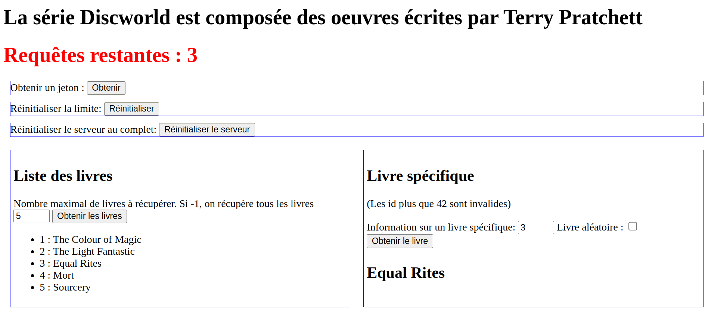

# Rate Limiter

Le _Rate Limiting_ est un mécanisme qui permet de gérer l'accès à un serveur ou API publique à travers le nombre ou quantité de requêtes permises par un agent externe.

Par exemple, un service peut limiter un utilisateur à 1000 requêtes par jour ou 1000 requêtes gratuites avant de rendre le service payant. 

Habituellement, ce mécanisme est implémenté à l'aide d'un jeton généré par le serveur et donné au client. Ce jeton doit être envoyé avec chaque requête pour identifier l'utilisateur et lui donner accès au service. Le serveur garde un compteur du nombre de requêtes effecutées par le client et donne ou non l'accès au service en fonction de la limite configurée.

## Installation des dépendances et lancement du serveur

Vous devez installer les dépendances du projet avec la commande `npm ci` dans le dossier `server`.

Vous pouvez lancer le serveur avec la commande `npm start`.

## Projet à implémenter

Cet exercice est une mise en oeuvre d'un mécanisme de _rate limiting_ d'un service qui permet d'accéder à des informations (ici l'ensemble des oeuvres de la série `Discworld` de l'auteur Terry Pratchett). Ce service est accessible seulement à travers un jeton envoyé dans l'en-tête des requêtes HTTP et possède une limite de 5 (configurable dans le serveur) requêtes par jeton. 

Vous devez faire appel aux notions d'utiliastion de la librairie Express et la sémantique du protocole HTTP.

## Site Web et côté client

Le dossier [client](./client/) contient un site web qui intéragit avec le service web. Le code dans [script.js](./client/script.js) fourni vous aidera à comprendre comment le service fonctionne et quels sont les différents codes de retours attendus par vos gestionnaires de routes. Vous êtres encouragés de consulter le code du client avant de commencer à implémenter votre solution.

Voici un exemple du site web après avoir effectué les actions suivantes :
- Obtenir un jeton
- Récupérer les 5 premiers livres
- Obtenir le livre ayant l'`id` **3**

## Service web et côté serveur

Le service du serveur dans le dossier [server](./server) expose les routes suivantes :
- `GET /token` : permet de générer un jeton et le retourner au client. Le jeton est enregistré dans l'objet `limits` et a un compteur qui commence à `MAX_COUNT` (par défaut : 10).
- `DELETE /reset` : réinitialise tout le serveur et retire les jetons octroyés aux clients.

Vous devez compléter le code dans [server.js](./server/server.js) pour avoir les fonctionnalités suivantes. Pour vous aider dans votre implémentation, le jeton `abc` est ajouté par défaut dans la liste de jetons disponibles au lancement du serveur.

### Fonctionnalité #1 : Accès aux données

Vous devez implémenter un ou plusieurs gestionnaires sur les routes suivantes :

- `GET /books?maxCount={X}` : retourne tous les livres disponibles. Si l'attribut optionnel `maxCount` est présent, retourne les `X` premiers livres. Par exemple, `GET /books?maxCount=5` devrait retourner les 5 premiers livres et `GET /books` devrait retourner tous les livres disponibles.
- `GET /books/{id}?random=X` : retourne un livre en fonction de son attribut `id`. Si l'attribut optionnel `random` est présent et a la valeur "true", `id` est ignoré et un livre aléatoire est retourné à la place. Vous devez gérer le cas où la valeur `id` envoyée ne correspond à aucun livre.

Dans les 2 cas, vous devez accepter une requête sur le préfixe `/books` seulement si la requête contient un jeton valide dans l'en-tête `X-AUTH`. Sinon, vous devez retourner un code HTTP en lien avec le problème. Notez que cette limite s'impose sur n'importe quelle requête HTTP et non seulement les requêtes `GET`.

### Fonctionnalité #2 : Gestion de la limite

Pour chaque accès aux données, vous devez vérifier si le jeton n'a pas atteint sa limite de requêtes configurée à sa création. 

Si la limite est atteinte, la réponse du serveur doit contenir un code HTTP en lien avec le problème et ne pas donner accès aux donnnées. Si la limite n'est pas atteinte, le compteur associé au jeton doit être décrémenté et la gestion de la requête devrait avoir lieu tel que décrit plus haut.

Vous devez compléter le gestionnaire de la route `PATCH /token/reset` qui permet de réinitialiser la limite d'un jeton à sa valeur initiale (`MAX_COUNT`). Un client peut envoyer son jeton et demander à ce que sa limite soit remise à sa valeur maximale, peu importe sa valeur en cours. Vous devez gérer le cas où la demande de réinitialisation ne contient pas un jeton valide.

La réponse de toutes ces routes doit contenir l'en-tête `X-LIMIT` dont la valeur est le nombre de requêtes restantes pour aider le client de connaitre ses limites.

# Exercice supplémentaire

L'implémentation de la gestion de la limite se base sur un nombre fixe de requêtes avant d'atteindre la limite. Vous devez implémenter une approche qui utilise également le temps de la première requête pour réinitialiser le nombre de requêtes restantes.

La constante `MAX_TIMEOUT` (valeur par défaut de 10) indique le nombre de secondes nécessaires pour réinitialiser la limite. Le calcul se fait entre le moment de la 1re requête avec un jeton quelconque et le moment de la dernière requête. Si le laps de temps est plus grand que `MAX_TIMEOUT`, le compteur du jeton est remis à sa valeur initiale, et le moment de la dernière requête est utilisé comme le nouveau temps initial.

Par exemple : 
Un client fait sa première requête à `13:00:00`. Il peut effectuer 4 autres requêtes avant d'atteindre sa limite de 5. 

Si la 4e requête a lieu à `13:00:05`, le client ne peut pas faire d'autres requêtes avec le même jeton jusqu'à `13:00:10` à moins de faire une demande de réinitialisation avec `PATCH /token/reset`. 

Si le client fait sa 4e requête à `13:00:11` ou après, le compteur est réinitialisé et il a encore 4 requêtes.

# Solution

Une solution possible est disponible dans le fichier [solution.js](./server/solution.js). Vous pouvez démarrer un serveur avec la solution avec la commande `npm run solution`.