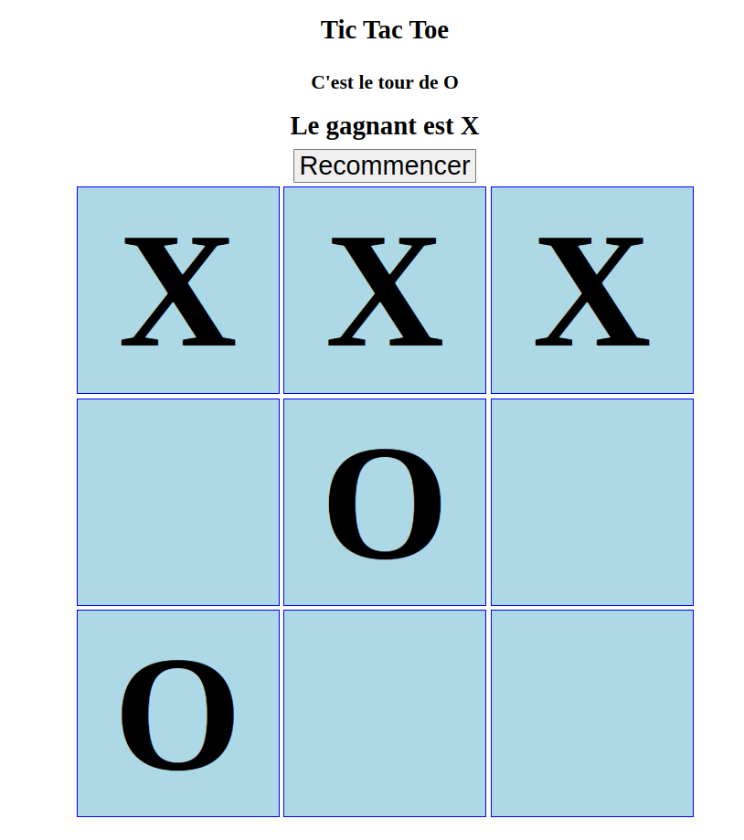

# Tests unitaires

## Mise en situation

Le code fourni est une implémentation simple du jeu TicTacToe entre 2 joueurs : `X` et `O`. Vous pouvez essayer le site web en lanceant un serveur statique avec la commande `npm start`. Assurez-vous d'installer les dépendances avec `npm ci` en premier.

Commençant par `X`, chaque joueur peut cliquer sur une des 9 cases vides du plateau de jeu et y indiquer son identifiant. Le jeu se termine si un joueur place 3 fois son identifiant dans une ligne (horizontale, verticale ou diagonale) ou s'il ne reste plus de cases vides à cliquer. Tout clic après la fin d'une partie est ignoré.

Le bouton `Recommencer` permet de reprendre la partie à partir de l'état initial et est disponible à tout moment de la partie.

### Interface du jeu

## Code à tester

Le code source fourni contient 2 classes : [BoardManager](./src/boardManger.js) qui contient la logique d'intéraction avec le plateau et [TicTacToe](./src/ticTacToe.js) qui contient la logique du jeu en soi.

Vous devez implémenter les tests unitaires nécessaires pour tester le code source dans les fichiers [boardManager.test.js](./tests/boardManager.test.js) et [tictacToe.test.js](./tests/ticTacToe.test.js). La fonction `buildHTML()` vous est fournie dans [boardManager.test.js](./tests/boardManager.test.js) pour vous aider. Vous pouvez la modifier et y ajouter du code au besoin.

Un test "vide" (`expect(true).toEqual(false);`) est présent dans chaque suite de tests pour déclencher l'exécution de la suite.

## Tests unitaires

Cet exercice vise la mise en place de tests **unitaires**. Vous devez donc vous assurer que les dépendances externes de l'unité que vous testez sont bien gérés. Faites appel aux notions de _Stub_, _Mock_ et _Spy_.

## Installation des librairies de tests

Les dépendances nécessaires sont définies dans le fichier [package.json](./package.json). Vous pouvez utiliser la commande `npm ci` pour installer la version exacte de la librairie utilisée pour la solution.

## Exécution des tests

Vous pouvez vérifier votre code avec les commandes `npm run test` et `npm run coverage` qui vont exécuter les tests sur votre code et, dans le cas de la 2e commande, calculer le taux de couverture.

**Important** : une couverture de 100% n'est pas un garant de code complété. Assurez-vous que tous les tests que vous avez implémenté réussissent.

# Solution

Une solution est disponible dans les fichiers [boardManager.solution.test.js](./tests/boardManager.solution.test.js) et [tictacToe.solution.test.js](./tests/ticTacToe.solution.test.js). Notez qu'il peut avoir plus qu'une manière d'implémenter correctement l'exercice. 

Notez que, par défaut, l'exécution de ses tests est ignorée à cause de la méthode `skip` sur la fonction `describe`. Vous pouvez retirer `skip` pour exécuter les tests, mais ceci peut fausser le taux de couverture de vos propres tests.